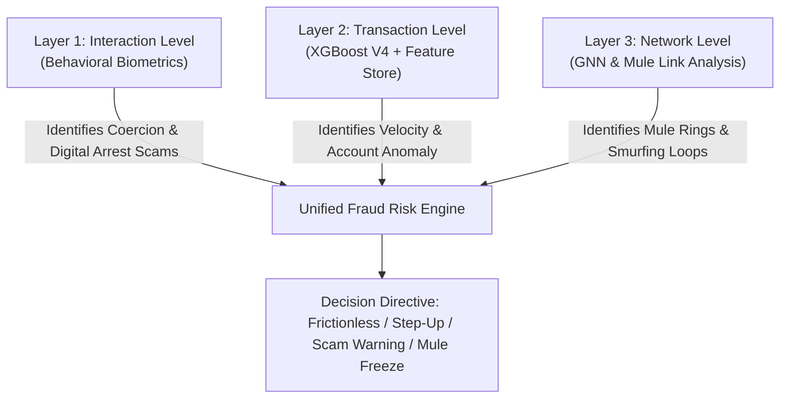

# AI DEFENSE LAB FOR PAYMENT SECURITY
*Red Team × Blue Team • 3-Layer Defense Triad (Biometrics × XGBoost × GNN)*

A state-of-the-art payment fraud security lab engineered with the **Multi-Layered Defense Triad**, **Adversarial Red-Team simulation**, and a **GenAI strategy & explanation layer**.

---

## 🛡️ Multi-Layer Defense Triad Architecture

The platform defends against payment fraud across all three critical operational layers:



### 🟢 Layer 1: Behavioral Biometrics Engine ([services/biometrics_service.py](file:///d:/ecg/defenselab/AI-DEFENSE-LAB/services/biometrics_service.py))
- **Keystroke Dynamics**: Analyzes typing dwell time, flight time, and speed variance.
- **Coercion & Vishing Detection**: Detects active voice call telemetry (`on_call_detected`), remote desktop overlays, and submission hesitation pauses to prevent **Digital Arrest / Social Engineering scams**.
- **Bot Automation Defense**: Identifies robotic 0ms flight time distributions.

### 🔵 Layer 2: Real-Time Transaction Engine ([services/fraud_service.py](file:///d:/ecg/defenselab/AI-DEFENSE-LAB/services/fraud_service.py) & [services/feature_store.py](file:///d:/ecg/defenselab/AI-DEFENSE-LAB/services/feature_store.py))
- **Fortified XGBoost V4 Classifier**: Fast vectorized inference (<35ms for 1,000 transactions).
- **Server-Side Real-Time Feature Store**: Derives 5m rolling velocity, 30d averages, and IP risk server-side to prevent client feature tampering.
- **TreeSHAP Exact Explainability**: Mathematical marginal feature weights directly extracted from tree booster paths.
- **Closed-Loop Adversarial Retraining**: Retrains model with balanced benign replay buffers (FPR < 0.8%).

### 🟣 Layer 3: Graph Network & Mule Ring Analyzer ([services/gnn_service.py](file:///d:/ecg/defenselab/AI-DEFENSE-LAB/services/gnn_service.py))
- **Directed Fund-Flow Topology**: Tracks money movements across accounts and beneficiaries.
- **Cyclic Laundering Loop Detection**: Identifies closed laundering cycles (e.g. `A → B → C → A`).
- **Fan-Out Smurfing & Fan-In Aggregation**: Detects rapid fund dispersal to mule clusters.
- **Topology Graph Exporter**: Live export of network nodes and edges for visual link analysis.

### ⚖️ Unified Defense Fusion Engine ([services/defense_triad.py](file:///d:/ecg/defenselab/AI-DEFENSE-LAB/services/defense_triad.py))
- Fuses all three layers (`20% Biometrics + 50% XGBoost + 30% GNN Network`).
- Outputs actionable policy directives:
  - `FRICTIONLESS_APPROVAL` (Normal green-light processing)
  - `STEP_UP_BIOMETRIC_CHALLENGE` (Moderate risk step-up)
  - `COERCION_SAFETY_INTERVENTION` (Digital arrest / scam safety delay)
  - `MULE_SYNDICATE_FREEZE` (Immediate multi-hop fund freeze)

---

## 🚀 Quickstart Guide

### 1. Backend Setup

```bash
cd defenselab/AI-DEFENSE-LAB
py -3.12 -m pip install -r requirements.txt
py -3.12 app.py
```
*API runs at `http://127.0.0.1:5000`.*

### 2. Frontend Setup

```bash
cd frontend
npm install
npm run dev
```
*Frontend runs at `http://localhost:5173`.*

---

## 📡 API Endpoints

### 3-Layer Defense Triad
- `POST /predict/triad` - Evaluates full multi-layer payload (Transaction + Keystroke Telemetry + Sender/Receiver).
- `GET  /network/topology` - Fetches live directed graph nodes & edges.
- `POST /simulate/mule-syndicate` - Simulates a multi-node coordinated mule syndicate attack.

### Core Security & ML
- `POST /predict` - Score a single transaction with server-side feature derivation.
- `POST /run-red-team` - Batch adversarial simulation with stochastic noise & evasions.
- `POST /retrain` - Dynamic closed-loop model retraining with balanced replay buffers.
- `GET  /metrics` - Live Round 2 vs. Round 3 fortified performance metrics.
- `POST /genai/explain` - 360° explanation grounded on exact TreeSHAP contributions.
